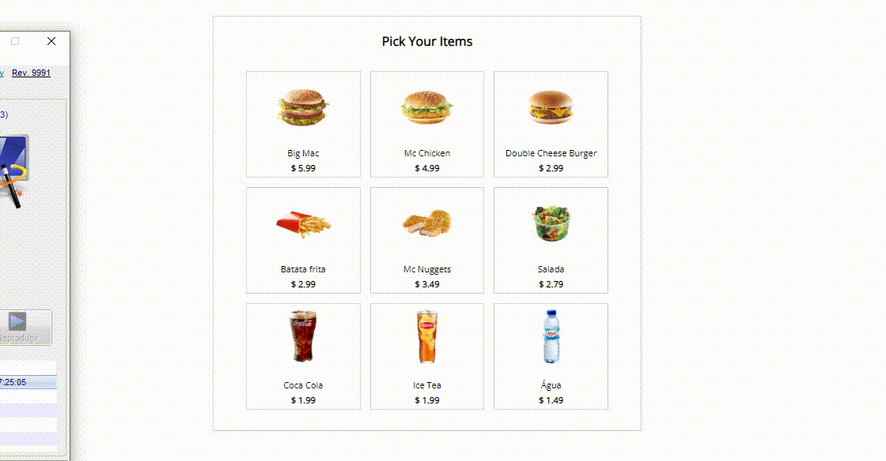

# machine self service

O projeto é um painel com produtos onde você pode seleciona-los a medida que vai definindo o produto que você quer e a quantidade o carrinho vai calculando.

## Tecnologias utilizadas

<ul>
  <li>HTML5</li>
  <li>CSS3</li>
  <li>Vue3</li>
</ul>

## Screenshot

